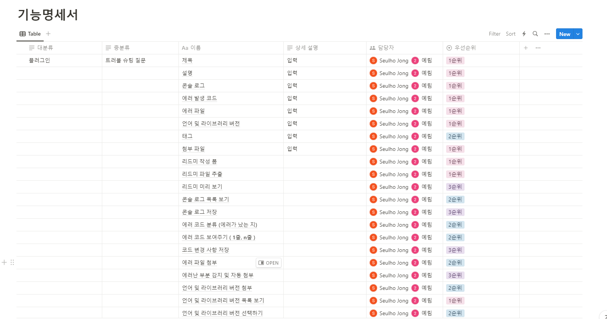

# 2023-10-26
- IntelliJ 플러그인 UI 큰 틀 완성

# 2023-10-25
- IntelliJ 플로그인 손피그마 완성

# 2023-10-24
- IntelliJ 플러그인 개발 프로세스 정리
- IntelliJ 플러그인 UI 개발 시작

# 2023-10-23
- IntelliJ 플러그인 레퍼런스 찾기 및 학습

# 2023-10-20
- IntelliJ 플러그인 개발 방법 공부
- IntelliJ 플러그인 개발을 위한 프로젝트 생성

# 2023-10-19
- 기능 명세서 작성

- 역할 분담
- IntelliJ plugin 개발 방법 공부

# 2023-10-18
- 주제 변경 : 버그 리포팅
- 핵심 가치
    - 프로젝트 진행중 팀원간의 버그 리포팅 및 버그 해결
    - 트러블 슈팅 문서 자동화
    - 트러블 슈팅 공유 커뮤니티
- 버그 리포팅 흐름
    1. 크롬 확장을 통한 버그 리포팅(또는 vscode 확장, 인텔리제이, 이클립스 확장 ⇒ 해결 되면 확장 알람)
    2. 우리의 버그 리포팅 사이트에 업로드 됨(전체 공개 및 비공개)
    3. 해당 프로젝트 인원들에게 공지
    4. 커밋 후 푸시로 해결 
    5. 해결한 커밋으로 버그 리포팅 답변 및 해결 방법 연결 업로드(푸시 이벤트로 자동화 혹은 유저 수동 업로드)
    6. 게시글 완성

- 확장
    - 버그 리포팅 목록을 통한 프로젝트 별 트러블 슈팅 문서 자동화
    - 유저 사용자간의 트러블 슈팅 공유

- 에디터 확장
    - 버튼을 누르면 트러블슈팅 글을 작성하여 올리는 창이 생김
    - 구성요소
        - 글제목
        - 글내용(사용자가 임의로 입력이 가능한 텍스트 박스)
        - 에러가 발생한 코드 위아래로 n줄(사용자 선택 가능)
        - 에러 전문 텍스트파일 첨부
    - VS Code, IntelliJ
    - 버전 정보

- 기능 명세서
    - IntelliJ
        - 계정 연동
        - 에러 로그 저장
        - 트러블슈팅 올리기 / 에러 발생 문제 올리기
        - 가장 최근 에러 자동으로 (디폴트 설정으로)
        - [README.md](http://README.md) 변환
        - gitlab, velog 등 개인 블로그에 연동
        - 버전 감지
        - 태그
    - Visual Studio Code
        - 계정 연동
        - 에러 로그 저장
        - 트러블슈팅 올리기 / 에러 발생 문제 올리기
        - 가장 최근 에러 자동으로 (디폴트 설정으로)
        - [README.md](http://README.md) 변환
        - gitlab, velog 등 개인 블로그에 연동
        - 버전 감지
        - 태그
    - Chrome Extension
        - 계정 연동
        - 에러 코드 저장
        - 글 올리기
        - [README.md](http://README.md) 추출
        - 네트워크 통신 내역
        - 스토리지
        - 태그
        - 로그 감지
        - 버전 감지

# 2023-10-17
1. 메인 페이지 ( 로그인 안했을 때 )
    - 로그인 버튼
    - 서비스 소개
2. 프로젝트 목록 페이지 ( 로그인 했을 때)
    - 필터
        - 종료중/진행중
        - 날짜
    - 검색
        - 프로젝트 이름으로 검색
3. 프로젝트 생성 페이지
4. 프로젝트 상세 페이지 
    - 팀장
    - 팀원
    - 종료
    - 메인 탭
        - 이슈관리, {(스티커 메모, 히트맵), (ERD, 흐름도)}, 프로젝트 홈

# 2023-10-16
- 프로젝트 관리 툴
    - 프로젝트 관리 및 진행도 확인을 위한 관리 웹 사이트

- 주요 대상
    - 소규모 프로젝트를 진행하려는 팀
    - 프로젝트 경험이 많이 없는 팀

- 핵심 가치
    - 프로젝트 아이디어 선정 및 기획, 설계를 위한 툴
    - 프로젝트 진행중 팀장의 팀원 관리를 위한 기능 제공(각 팀원 및 팀전체의 현황)
    - 본인이 진행한 프로젝트의 완성도(테스트 코드 기준) 및 UI 진행도(피그마 이미지 분석)를 이슈를 통해 파악 가능
    - 랭킹 시스템으로 팀원들의 프로젝트 진행을 격려

- 아이디어 및 기획 설계 기능
    - 프로젝트 설계시 필요한 ERD, 플로우 차트, 목업 그릴 수 있도록 제시
    
    - 브레인 스토밍 기획 ui 제공(스티커 메모 형식으로 자유롭게 작성 및 좋아요, 댓글, 작성자), 아이디어 기획 히트 맵 그래프, 최신순, 언급순, 좋아요 순 등등
    
    
    
- 프로젝트 진행 중 팀장 전용 기능
- 프로젝트 전체적인 진척도 제공
    - 백엔드와 프론트 진척도 비교
    - 인원 별 진척도 전체적 비교
- 백엔드 기능 완성도 제공 : 테스트 코드
    - 각 인원별로 진척도, 커밋 별 코드 줄 수
    - 각 이슈별로 진척도
    - 전체적인 진척도
- 프론트엔드 기능 진척도 제공 : 테스트 코드
    - 각 인원별로 진척도, 커밋 별 코드 줄 수
    - 각 이슈별로 진척도
    - 전체적인 진척도
- 팀원별 통계 서비스
    - 전체적인 사원들의 커밋 수, 코드 줄 수, 진행한 시간 등등
- 이미지 비교 ai를 활용한 ui 진척도 제공 : 피그마 ouath, 깃허브 ouath 활용

# 2023-10-13
-  AI 커버 프로젝트
- AI를 이용한 목소리, 음원 합성 / 합성한 결과물을 이용한 다양한 컨텐츠
- 재미있는 프로젝트
- 사용해보고 싶은 프로젝트
- 본인 목소리를 이용해야하므로 동의 필요
- 내 목소리만 가능하게
    - 서비스에서 제공하는 스크립트를 읽게해서 그 스크립트가 아니면 자신이 녹음한 것이 아니라는 것으로 판정
- 음원과 본인 목소리 파일을 직접 준비하여 합성해야함
- 합성한 결과물은 유튜브 재생목록에 업로드하여 저작권으로 합당여부를 유튜브에 위임
- 신고 기능을 사용하여 부적절한 음원 관리
    - 신고로 사용 불가능한 음원에 대하여 관리

기능
- 합성할 원본 음원 및 본인 목소리가 녹음된 녹음 파일을 이용하여 합성된 음원파일 관리 및 다운로드
    - 키도 변경이 가능해서 여자1 여자2, 남자1 남자2 혹은 고음1 저음1 뭐 이런식으로 바꿔서 학습시키는 기능도 넣으면 좋겠다.
- 자유롭게 게시판 및 자랑
    - 학습된 모델 공유 및 음원, 플레이 리스트 공유 가능
- 나만의 플레이리스트
    - 내가 만든 모델을 기준으로 합성한 음원들 리스트
- 다른사람들의 플레이리스트
    - 게시판 및 다른 사람들 프로필을 통하여 공유
- 학습된 목소리 AI 모델 공유
    - 게시판 및 다른사람 프로필을 통하여 공유
- 각종 랭킹 및 추천 서비스
    - 우리 사이트에서 많이 사용된 음원
    - 유튜브 기준 인기 음원
    - 우리 사이트에서 가장 많이 공유된 AI 모델
- 합성한 음원에 해당하는 앨범 표지 사진 생성
    - AI를 활용하여 본인 프로필을 이용한 음원의 앨범 사진 생성
- 휴지통
    - 클론과 대결, 실제 내 노래와 합성한 노래를 비교
        - ai 부른 노래는 더 완벽하니깐 본인의 노래와 비교하면서 점수라든가 정형화된된 수치를 이용해서 실력향상이라든가 자기만족이라든가 자랑이라든가 를 할수있으면 좋겠다.

# 2023-10-12
- 저작권에 대해서 무지하게 알아봄.
- 사용할 음원을 사용자가 직접 준비 및 사용 가능한 음원에 대해서만 진행
    - 신고 기능을 통하여 사용 가능한 음원만 사용하도록
- 유튜브를 사용한 저작권 확인
    - 유튜브에 해당 합성한 음원을 업로드하고 문제가 생길시 업로드가 안되도록 하는 유튜브 시스템을 이용하여 저작권 문제 해결
    - 업로드에 사용한 음원 및 원작자 등 필요한 사항들을 명확하게 기재
- 유튜브 커버곡 저작권
    - https://ground.buv.co.kr/library/view/8
    - 원칙적으로 커버곡 또한 저작권에 걸림
    - 하지만 저작권을 일일히 원
    - “원칙적”으로 허락을 받아야 하는 사람
        - 저작권자
            - 작곡가
            - 작사가
            - 편곡가
        - 저작인접가
            - 실연자(가수)
            - 음반 판매자
    - 만약 직접 mr을 만들 경우
        - 저작권자
            - 작곡가
            - 작사가

# 2023-10-11
- 피그마 기반한 UI 진행도 및 완성도 체크 관리 툴 (구체화 필요)
- 프로젝트 초기 세팅 / 프로젝트 관리 / README 자동 작성 툴
- 소규모 프로젝트 자원 관리 (특정 기술 융합할수있었으면 좋겠다)
- 반응형 화면보호기 ( AI향 첨가 ) (볼륨 문제, 구체적인 서비스가 있었으면 좋겠다)
- 중국어 자연어처리 (보류)
- 전시관 메타버스 (창의성 부족)
- 모바일 명함 지갑 (있음, 더 특장점이 필요하다)
- 3인용 뱀파이어서바이벌
- 건축도면으로 메타버스 만들어주는 서비스
- ‘에브리바디 원투’ 같은 활동성이 있는 게임
- 객체 탐지 머신러닝 활용 스터디 어플리케이션
- 흥얼거리는 노래를 통하여 음악 찾아주는 서비스
