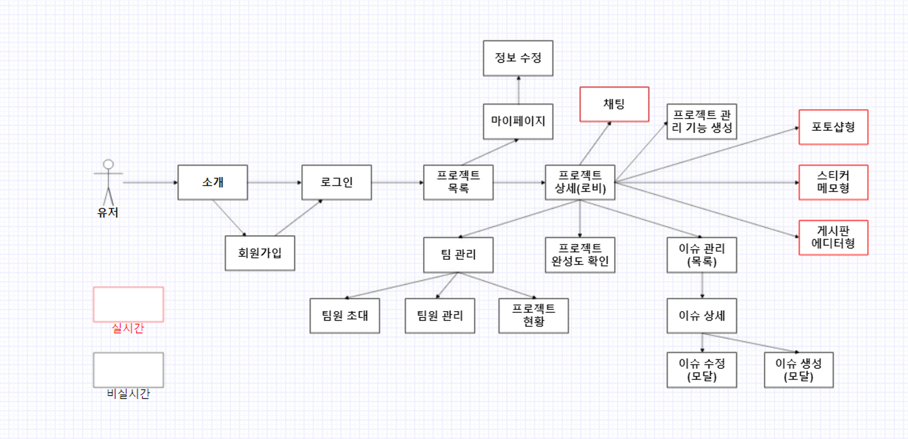

### 23-10-11
# 제시된 아이디어 목록

## 피그마 기반한 UI 진행도 및 완성도 체크 관리 툴 (구체화 필요)

- `구현 방법 : 크롬 확장 / VScode 확장`
- 피그마 및 개발 중인 사이트 비교하여 진행도 표시 또는 차이점(실수) 찾기
- 라우터 별로 완료한 부분 퍼센트 표시 등(VScode 사용 시 에디터 상에서 몇%인지 표시)

## 프로젝트 초기 세팅 / 프로젝트 관리 / README 자동 작성 툴

- `구현 방법 : VS코드 확장 / 인텔리제이 or 이클립스 확장 / 웹 상의 github API로 레포 생성 / 웹에서 설정 이후 node CLI 복사 붙여넣기 / 순수 node CLI`
- 초기 세팅 도와주는 툴(eslint, prettier, typescript, 테스트러너 설정, 테스트 설정, 디자인 패턴 / 포맷 옵션 / 컴파일 옵션 / 빌드 / 폴더 구조 등등)
- 자주 쓰는 세팅 저장 및 git hub api로 레포 관리
- spring boot, react 통합 레포 초기 세팅 만들기

스프링 부트 초기 프로젝트 세팅

https://start.spring.io/

---

## 소규모 프로젝트 자원 관리 (특정 기술 융합할수있었으면 좋겠다)

- 일정 관리
    - 처음 지라를 사용할 때 어려웠음 (복잡함, 기능 너무 많음)
    - 직관적이고 쉬운 단어를 사용한 관리 어플리케이션
- 인적 자원 관리
    - 싸피를 예로 팀원 간 평가가 있는데 상호 평가하는데 참고할 정량화된 지표가 없다.
    - 개인 이슈가 있을 때 구두로 전하는 경우가 많음

## 반응형 화면보호기 ( AI향 첨가 ) (볼륨 문제, 구체적인 서비스가 있었으면 좋겠다)

- 예시 : https://www.youtube.com/watch?v=cPEEJN1mHh0&ab_channel=InteractiveDeveloper

## 중국어 자연어처리 (보류)

- 학습 관련하여 아이디어 생각 해보면 좋을 듯

## 전시관 메타버스 (창의성 부족)

- 나의 프로젝트(gitLab, gitHub)를 전시할 수 있는 메타버스 공간
- or 메타버스 그림 전시 및 경매

## 모바일 명함 지갑 (있음, 더 특장점이 필요하다)

- 실물 명함 촬영 및 저장
    - ai 활용하여 텍스트 인식
- 자체 툴로 모바일 명함 제작
- 모바일 명함 전송
- 이력서, 자기소개서로 확장
- nft 시장이랑 연결해서 매매 가능하게
- 국제화
- 명함 많이 모으면 보상주던가 등등

## 3인용 뱀파이어서바이벌

RPG요소가 있고 친구들과 함께할수있는 로그라이크+로그라이트

## 건축도면으로 메타버스 만들어주는 서비스

직방같은 건물매매 관련도니 서비스에서 건축도면으로 메타버스 만들어주는데
그냥 만들어 주기만 하면 심심하니깐 건축도면으로 만들어진 메타버스에서 친구들과 놀수있는 여러가지 뭔가추가하면 좋지 않을까?

## ‘에브리바디 원투’ 같은 활동성이 있는 게임

휴대폰 버전으로

[https://namu.wiki/w/Everybody 1-2-Switch](https://namu.wiki/w/Everybody%201-2-Switch)!

[https://www.youtube.com/watch?v=rLw1P_sELcw&ab_channel=풍월량](https://www.youtube.com/watch?v=rLw1P_sELcw&ab_channel=%ED%92%8D%EC%9B%94%EB%9F%89)

## 객체 탐지 머신러닝 활용 스터디 어플리케이션

- MobileNet

## 흥얼거리는 노래를 통하여 음악 찾아주는 서비스

### 23-10-13
# AI 커버 프로젝트

# 📌주제

- AI를 이용한 목소리, 음원 합성 / 합성한 결과물을 이용한 다양한 컨텐츠

# 📌핵심 가치 및 프로젝트 목표

- 재미있는 프로젝트
- 사용해보고 싶은 프로젝트

# 📌이용약관 동의 및 제약사항에 필요한 기능

- 본인 목소리를 이용해야하므로 동의 필요
- 내 목소리만 가능하게
    - 서비스에서 제공하는 스크립트를 읽게해서 그 스크립트가 아니면 자신이 녹음한 것이 아니라는 것으로 판정
- 음원과 본인 목소리 파일을 직접 준비하여 합성해야함
- 합성한 결과물은 유튜브 재생목록에 업로드하여 저작권으로 합당여부를 유튜브에 위임
- 신고 기능을 사용하여 부적절한 음원 관리
    - 신고로 사용 불가능한 음원에 대하여 관리

# 📌기능

- 합성할 원본 음원 및 본인 목소리가 녹음된 녹음 파일을 이용하여 합성된 음원파일 관리 및 다운로드
    - 키도 변경이 가능해서 여자1 여자2, 남자1 남자2 혹은 고음1 저음1 뭐 이런식으로 바꿔서 학습시키는 기능도 넣으면 좋겠다.
- 자유롭게 게시판 및 자랑
    - 학습된 모델 공유 및 음원, 플레이 리스트 공유 가능
- 나만의 플레이리스트
    - 내가 만든 모델을 기준으로 합성한 음원들 리스트
- 다른사람들의 플레이리스트
    - 게시판 및 다른 사람들 프로필을 통하여 공유
- 학습된 목소리 AI 모델 공유
    - 게시판 및 다른사람 프로필을 통하여 공유
- 각종 랭킹 및 추천 서비스
    - 우리 사이트에서 많이 사용된 음원
    - 유튜브 기준 인기 음원
    - 우리 사이트에서 가장 많이 공유된 AI 모델
- 합성한 음원에 해당하는 앨범 표지 사진 생성
    - AI를 활용하여 본인 프로필을 이용한 음원의 앨범 사진 생성
- 휴지통
    - 클론과 대결, 실제 내 노래와 합성한 노래를 비교
        - ai 부른 노래는 더 완벽하니깐 본인의 노래와 비교하면서 점수라든가 정형화된된 수치를 이용해서 실력향상이라든가 자기만족이라든가 자랑이라든가 를 할수있으면 좋겠다.

# 📌컨설턴트님과 상의할 내용 및 질문

- 인공지능 학습을 위한 서버 컴퓨터를 교보재로 신청할 시 받을 수 있는 상세 스펙

# 📌사용 AI 모델

https://docs.google.com/document/d/1nA3PfQ-BooUpjCYErU-BHYvg2_NazAYJ0mvvmcjG40o/edit#heading=h.x5mtoparsl14

https://colab.research.google.com/drive/1kiUvz1TrNJa_MOfOld7DHanv4gZsl7MN

https://colab.research.google.com/drive/1zGPrh-qxscYU2mvhiv8rrjqEn0WHnOOF?usp=sharing

# 📌저작권 관련 사항

- 사용할 음원을 사용자가 직접 준비 및 사용 가능한 음원에 대해서만 진행
    - 신고 기능을 통하여 사용 가능한 음원만 사용하도록
- 유튜브를 사용한 저작권 확인
    - 유튜브에 해당 합성한 음원을 업로드하고 문제가 생길시 업로드가 안되도록 하는 유튜브 시스템을 이용하여 저작권 문제 해결
    - 업로드에 사용한 음원 및 원작자 등 필요한 사항들을 명확하게 기재
- 유튜브 커버곡 저작권
    - https://ground.buv.co.kr/library/view/8
    - 원칙적으로 커버곡 또한 저작권에 걸림
    - 하지만 저작권을 일일히 원
    - “원칙적”으로 허락을 받아야 하는 사람
        - 저작권자
            - 작곡가
            - 작사가
            - 편곡가
        - 저작인접가
            - 실연자(가수)
            - 음반 판매자
    - 만약 직접 mr을 만들 경우
        - 저작권자
            - 작곡가
            - 작사가
- 관련 자문
    
    
    
- content ID
    
    
    

- 소리소리 실제 서비스 중인 사례
    
    
    

# 📌참고 사항 및 실제 서비스 사례들

## 음악 서비스

- ai 커버 서비스
    - [https://www.youtube.com/watch?v=JMCxsc-kJ24&ab_channel=코딩애플](https://www.youtube.com/watch?v=JMCxsc-kJ24&ab_channel=%EC%BD%94%EB%94%A9%EC%95%A0%ED%94%8C)
- SoundClassification 모델 활용
- 소리소리 AI
    - 노래 커머 AI
    - https://sorisori.ai/
- 복면가왕 형식으로 서비스 제공
- 저작권 구독식 구매
    - artist
    - https://artlist.io/?utm_source=google&utm_medium=cpc&utm_campaign=16436103302&utm_content=136763079831&utm_term=artlist&keyword=artlist&ad=585016031026&matchtype=p&device=c&gclid=Cj0KCQjwj5mpBhDJARIsAOVjBdom0IXqBKsK9dQIY7JrPHrndKLM4ulz6GaGs-fNSfPy0oYp1Zlgmc0aAuBUEALw_wcB
- 유명 노래는 직접 연락을 해서 구매를 해야함
    - 현재 한국음악저작권협회 회원가입이 사이트 접속 이슈로 인해 불가능
    - AI 커버를 통한 저작권 이슈가 있어 저작권 질문이 들어오면 할말 없음
    - 저작권 없이 스트리밍 불가능
        - 사례를 찾아보니 5살 어린애가 손담비 노래 틀고 춤추는 영샹 걸려서 저작권 협회한테 소송비 냈다고 함

# 📌UCC 아이디어

- 클론대결(선글라스 쓴 슬호 vs 노말 슬호) - 이기고 나서 사라져라, 가짜

### 23-10-17

## 페이지 흐름도

